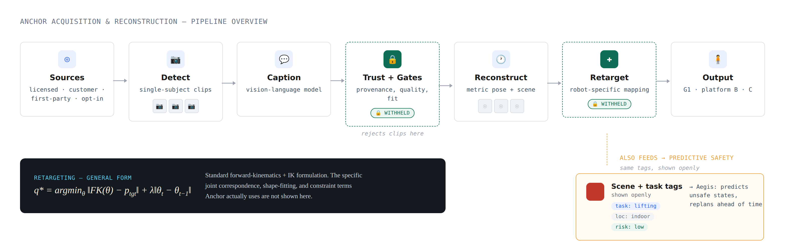

# Anchor

**Anchor** is HCS Labs' data refinery for humanoid robot learning: a pipeline
that turns ordinary human video into provenance-verified, feasibility-checked,
robot-ready training data.

This repository hosts the public project page and credits for the published
research Anchor's reconstruction stage builds on. The pipeline implementation
itself is closed for now — see [`pipeline/`](pipeline) for what that means and
what's planned.

---

## Acquisition & Reconstruction Pipeline



Raw video goes through detection, captioning, and trust-gating before 3D reconstruction and robot-specific retargeting. The same intake that produces training data also tags task type, location, and risk — feeding **Aegis**, our predictive safety system.

---

## Aegis — Predictive Safety Monitor

Anchor's intake doesn't just produce training data. Every clip that clears the pipeline has already been scene-understood — what task is happening, where, and how risky it is. That second branch is what **Aegis**, our world-model-based predictive safety system, runs on.

Aegis predicts a robot's likely future states across multiple time horizons (0.1s to 5s out), scores the trajectory, and proposes corrective action before a fault occurs — rather than stopping after one.

**In simulation** — world-model prediction running on a simulated scene:

https://github.com/user-attachments/assets/64e8937c-7a43-4a90-a8fb-40b29fb82590

**In the real world** — same model, running on real street footage:

https://github.com/user-attachments/assets/bdae5cb5-3c55-4ed0-a886-326ff0ab74b4

---

## What's here

```
index.html      the project page (no build step — just open it)
assets/         diagrams, validation imagery, and demo video clips
third_party/    credits for VideoMimic real2sim and Video-LLaMA
pipeline/       placeholder for the pipeline source — closed for now
```

## Live page

**[hcslabs.github.io/anchor](https://hcslabs.github.io/anchor/)**

---

## Status

Internal validation in progress. The page covers:

- Acquisition, reconstruction, and retargeting pipeline overview
- Validation against the published VideoMimic benchmark (SLOPER4D subset),
  re-run by us — see the page for what's our measurement vs. cited
- How the intake feeds both training data output and Aegis safety evaluation
- Trust-tier design (Intake → Trust → Gates → Enrich → Retarget → Package → Serve),
  with an honest accounting of what's validated, partially validated, and in development

## Ownership

© HCS Labs — Humanoid Control Systems株式会社.
